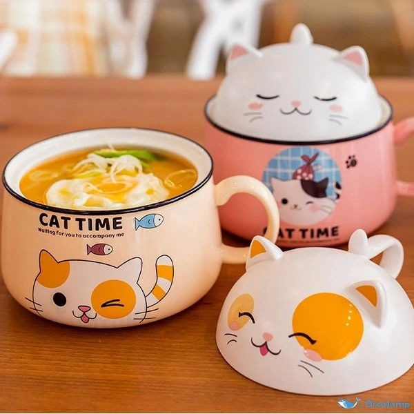

# Paw-s-Burger
<html>
<html lang="es">
<head>
    <meta charset="UTF-8">
    <meta name="viewport" content="width=device-width, initial-scale=1.0">
    <title>Menú del Restaurante</title>
    
</head>
<body>
    <header>
        <h1>Paw's Burger and Shake ᓚᘏᗢ </h1>
    </header>
    

        <nav>
            <h2>Menú del Restaurante</h2>
            <ul>
                <li><a href="#Bebidas de boba">Bebidas de Boba</a></li>
                <li><a href="#Café">Cafés</a></li>
                <li><a href="#plato3">Hamburguesas</a></li>
                <li><a href="#plato4">Ramen</a></li>
                <li><a href="#Galletas">Galletas</a></li>
                <li><a href="#plato6">Coctel de frutas</a></li>
  
            </ul>
        </nav>
        <section id="Gato Bebidas de Boba">
            <h2>Bebidas de Boba</h2>
            
            
Sabores: Mango, Taro, Lichi, Fresa y Maracuya

            
Precio: $75 

        </section>
        <section id="Catfés">
            <h2>Catfés</h2>
            
            
 Café cremoso a base de leche con espuma en forma de gatito.

            
Precio: $120

        </section>
        <section id="Hamburguesas">
            <h2>Miauburguesas</h2>
            
            
Hamburguesa de pollo o carne acompañada con papas

            
Precio: $130

        </section>
        <section id="Ramen">
            <h2>Meow Ramen</h2>
            
            
Ramen acompañado a elección, carne o pastel de pescado.

            
Precio: $140

        </section>
        <section id="Galletas">
            <h2>Michi Galletas</h2>
            
            
Galletas de mantequilla con diseño gatuno

            
Precio: $80 El conjunto de 5 galletas

        </section>
        <section id="Mini cat tail de frutas">
            <h2>Mini cat tail de frutas</h2>
            
            
Un postre pequeño, coctel de mora azul, sandía, melon, ciruela y mango
            
Precio: $25

        </section>
    

</body>
</html>
